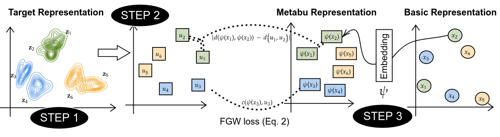

# Metabu - Learning meta-features
This is the Official code for ICLR 2022 paper **"Learning meta-features for AutoML"**, *Herilalaina Rakotoarison and Louisot Milijaona and Andry Rasoanaivo and Michèle Sebag and Marc Schoenauer*.





## Installation
Install with pip:

```bash
pip install -r requirements.txt
python setup.py install
```

## Usage

Simple to use:

```python
from metabu import Metabu

basic_representations = pd.read_csv(...)
target_representations = pd.read_csv(...)
metabu = Metabu()
metabu.train(basic_reprs=basic_representations,
             target_reprs=target_representations,
             column_id="task_id")
metabu.predict(basic_reprs=basic_representations)
metabu.get_importances()
```


Try with `cd examples; python metabu_adaboost.py`


## Experiments

> Scripts to reproduce experiments are available under the [**experiments** branch](https://github.com/luxusg1/metabu/tree/experiments).


## Credits

* We use the implementation of the ICML 2020 work **"Learning Autoencoders with Relational Regularization"** [https://arxiv.org/pdf/2002.02913.pdf] 
to compute the Fused-Gromov-Wasserstein distance.
* For the experiments, we use performance datasets from [Hyperparameter Importance Across Datasets](https://arxiv.org/pdf/1710.04725.pdf), J. N. van Rijn, F. Hutter. 
* We also grateful to the maintainers and contributors of the Python libraries in *requirements.txt*.

## Cite Metabu

``` 
@inproceedings{rakotoarison2022learning,
    title       = {Learning meta-features for Auto{ML}},
    author      = {Herilalaina Rakotoarison and Louisot Milijaona and Andry Rasoanaivo and Michele Sebag and Marc Schoenauer},
    booktitle   = {International Conference on Learning Representations},
    year        = {2022},
    url         = {https://openreview.net/forum?id=DTkEfj0Ygb8}
}
```
